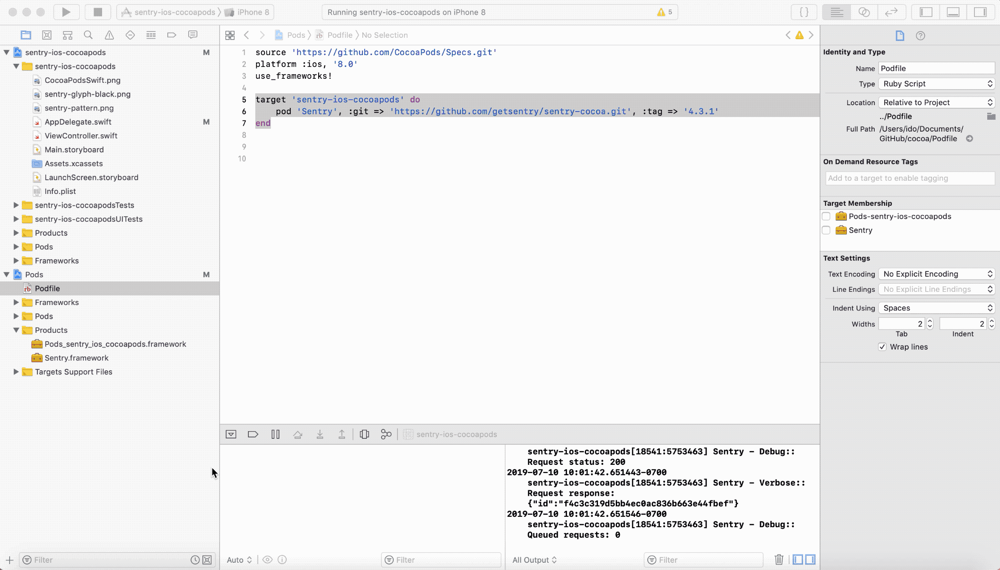
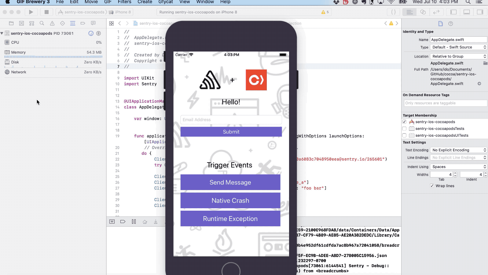

# Cocoa/iOS Demo

## Setup

1. Set `SENTRY_AUTH_TOKEN` as an environment variable or referenced in 'Run Script' build phase.

2. sentry-cli must be installed at /usr/local/bin

3. Click the Run/play button on the top left (sentry-ios-cocoapads > iPhone 8)

## Flow/Demo

1. From the Simulator click **Send Messge** to explicitly send an event to Sentry.

2. To demo a **Native Crash** you will need to relaunch the device directly from Simulator:
- From XCode, click on the Stop button
- From Simulator, click on File > Close Window
- From Simulator, select Hardware > Device > IOS XX.X > IPhone 8
- In the simulator instance window, launch the app, click on Native Crash / Runtime Exception 
- The app will freeze for a few seconds and eventually crash 
- Once you click on the app to relaunch it the event is sent to Sentry

## Documentation/Resources

https://docs.sentry.io/clients/cocoa/
