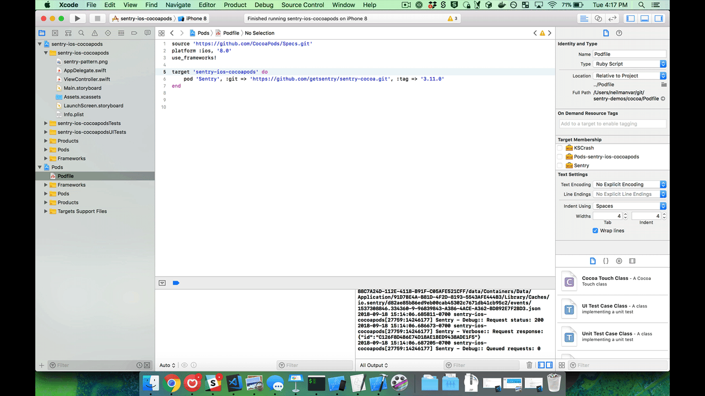

# Cocoa/iOS Demo

## Setup

1. Set `SENTRY_AUTH_TOKEN` as an environment variable or referenced in 'Run Script' build phase.

2. sentry-cli must be installed at /usr/local/bin

3. Click the Run/play button on the top left (sentry-ios-cocoapads -> iPhone 8)

## Flow/Demo

## Documentation/Resources

https://docs.sentry.io/clients/cocoa/
